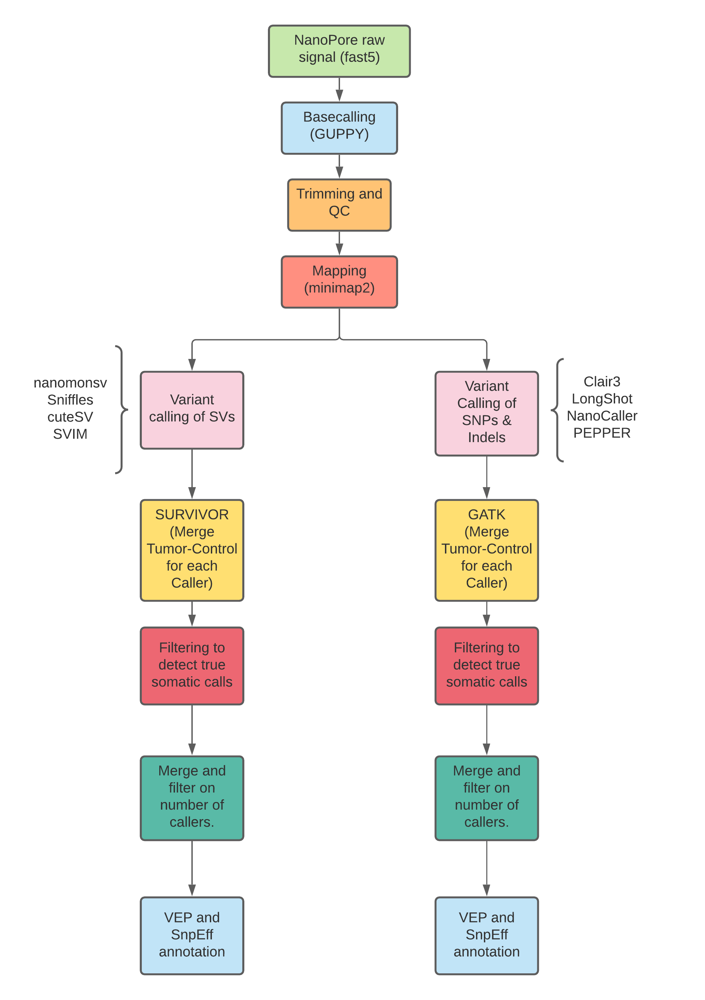

# Neoantigen prediction with long read WGS

  

This pipeline is designed to predict potential neoantigens leveraging the long read sequencing technology. The objective is to use WGS long read with paired normal-tumor data to call for somatic structural variants as well as somatic SNPs and short indels to predict potential new targets in cancers.

The pipeline as of now only processes WGS data (RNA pipeline to be implemented) performing the following steps:

- Basecalling of the raw nanopore fast5 to obtain FASTQ files. (`GUPPY`)
- Trimming and Quality control (`Nanofilt` and `FastQC`)
- Mapping to the genome (`minimap2`)
- Structural variant calling (`nanomonsv`, `Sniffles`, `cuteSV`, `SVIM`)
- SNP and short Indel variant calling (`Clair3`, `NanoCaller`, `PEPPER`, `LongShot`)
- Merge of structural variants (`SURVIVOR`)
- Merge of SNPs and short Indels (`GATK CombineVariants`)
- Custom script for filtering on somatic calls.
- Custom script for filtering on number of callers for True Positive variants.
- Variant Annotation (`VEP` and `SnpEff`)

## Authors

Jonatan González Rodríguez <jonatan.gonzalez.r@outlook.com>
